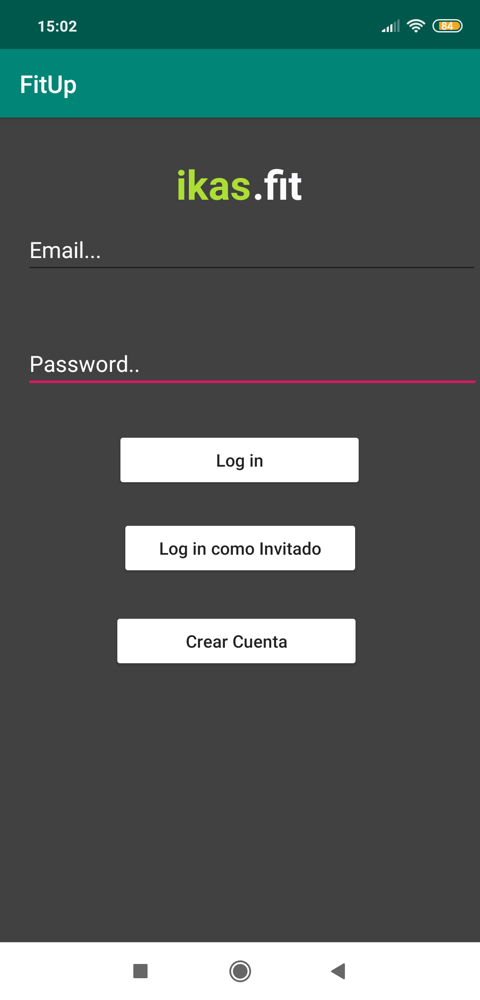
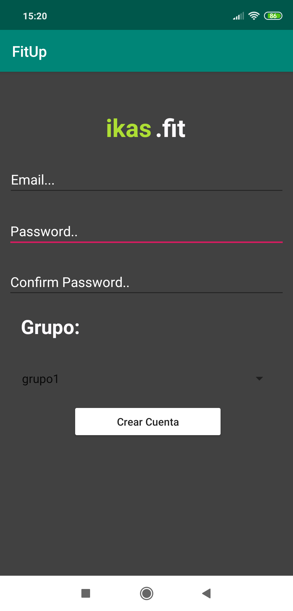
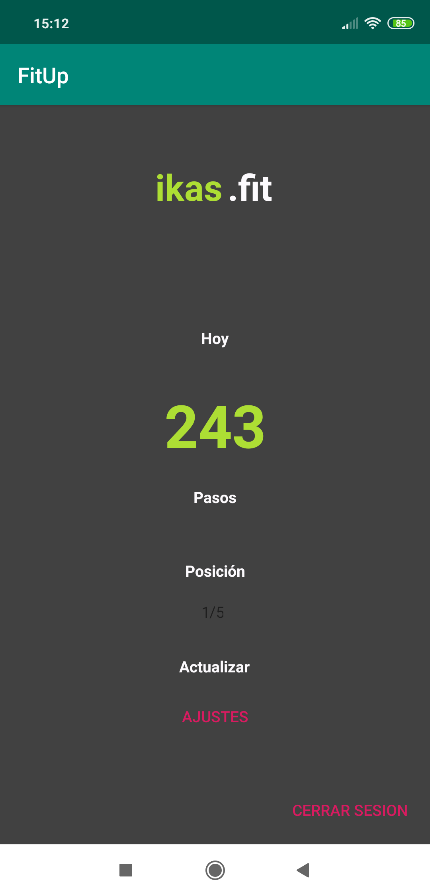
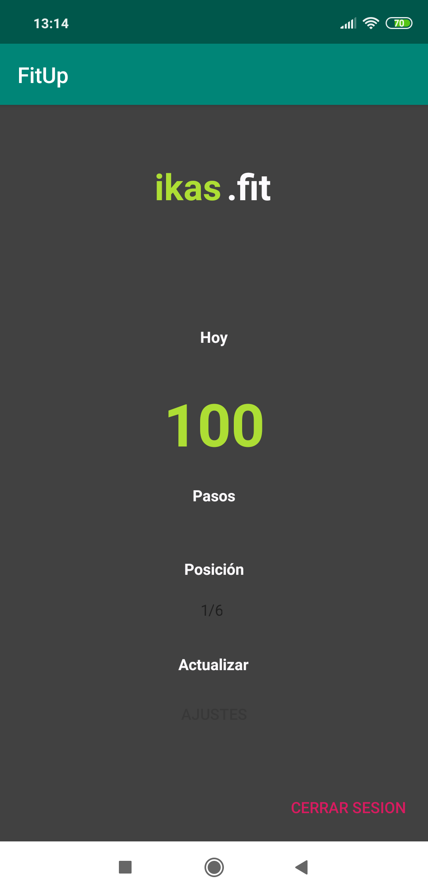
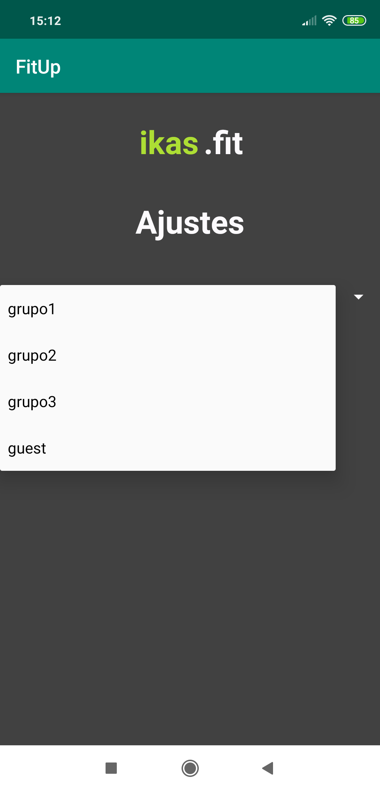

# ProyectoDAM1819

### Base de Datos

La base de datos está organizada con las siguientes tablas

##### Groups
Contiene el nombre de los grupos, los usuarios anónimos se les asigna un ID como "guests", los demás usuarios (identificados) pueden escoger el preferido

##### User
Contiene los usuarios con la siguiente estructura

    - user
        - uID
            - group
            - steps 
            - top
            - uid
    
##### usergroup
Contiene la "relación" de uId y el grupo al que pertenece

#### Funcionalidad de la aplicación

##### Login
Empezamos por el login, se puede acceder diréctamente a la aplicación como usuario anónimo, en este caso no hay que especificar nada, se le incluirá en el usergrupo de "guest".

#

##### Crear Usuario

Hay que especificar el grupo y los datos correspondientes, sin eso, saltará un aviso indicando que hay datos vacios. Al crear la cuenta se inicia sesión automáticamente y entra a la ventana principal.

# 

##### Pantalla Principal

La pantalla principal se vé así, los pasos y la Top de posición se van actualizando en tiempo real en la base de datos. El top de posiciones se acutaliza teniendo en cuenta el grupo en el que estés.

# 

Los Usuarios anónimos no pueden darle al botón de ajustes para cambiar de grupo.

#

##### Ajustes

Al darle a Ajustes el usuario podrá cambiarse a dicho grupo.

#
